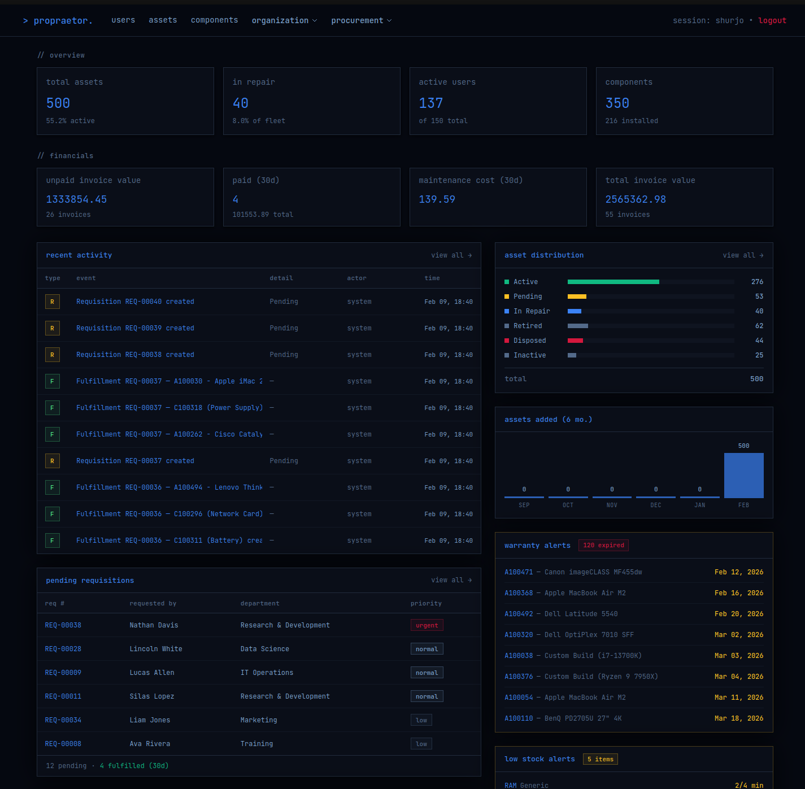
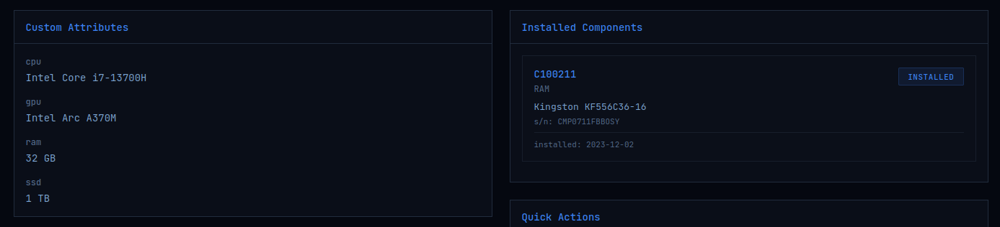
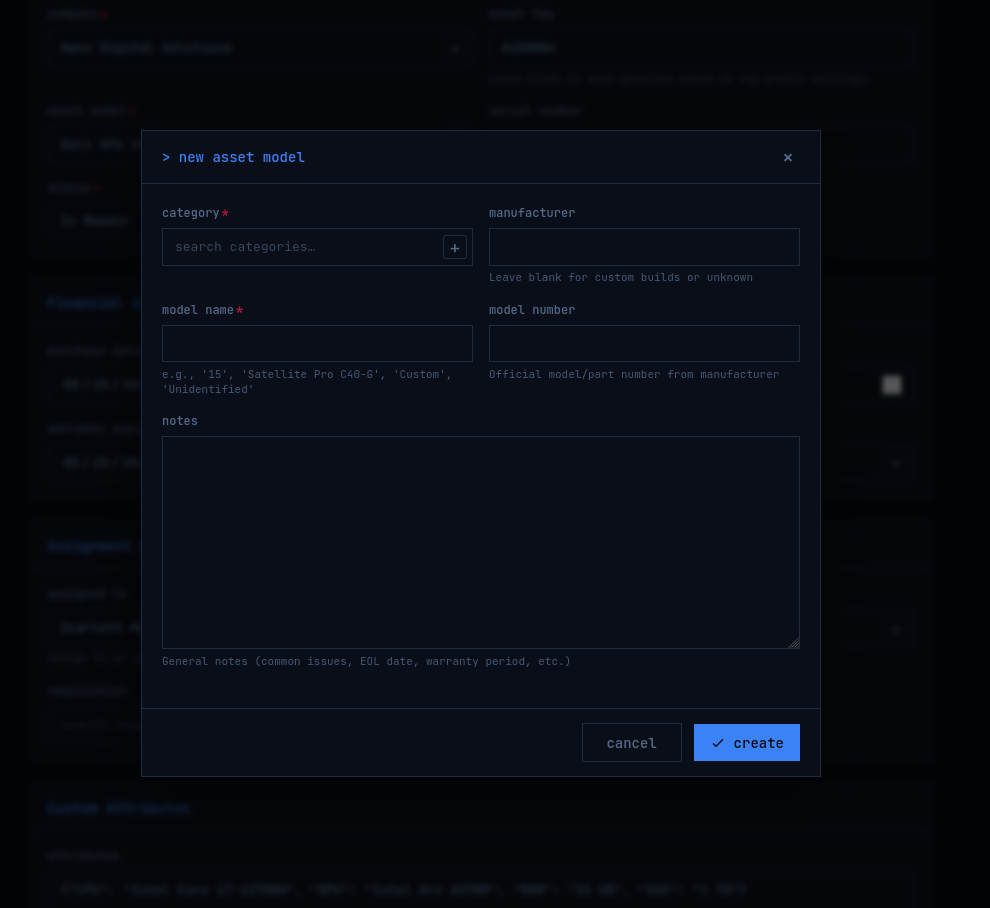
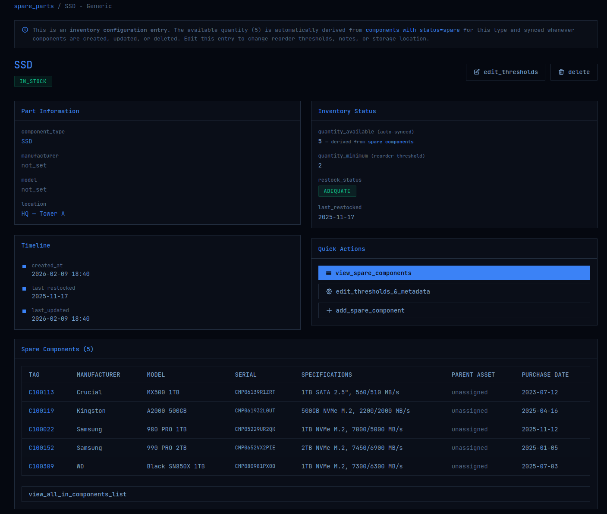
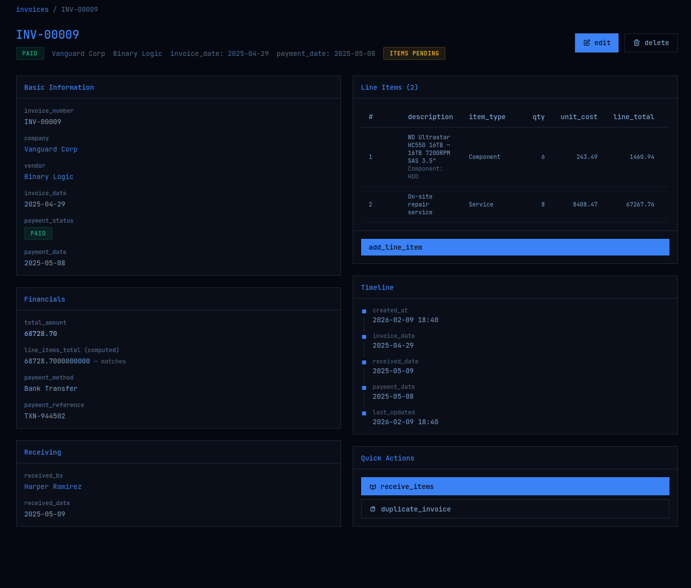
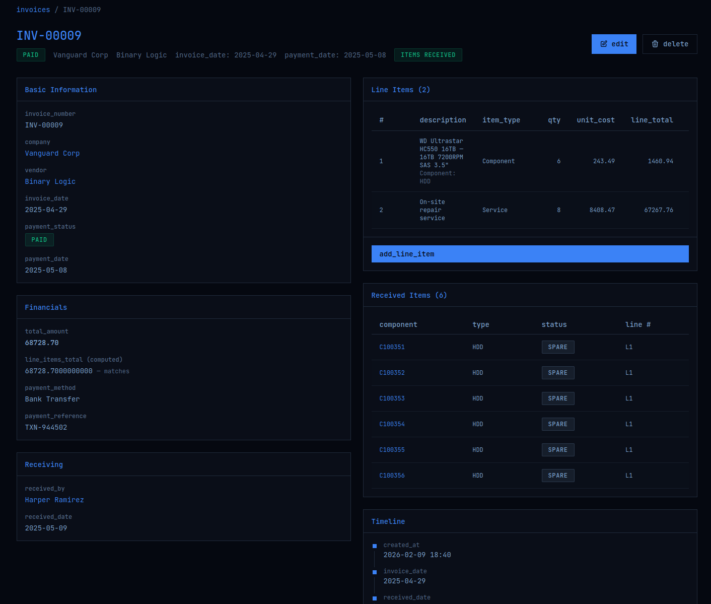

<div align="left">


**/pɹəʊˈpɹiːtɔː/** · Latin *propraetor*, a magistrate sent to govern a province.

Server-rendered, self-hosted asset management solution. Fast, sleek, lightweight.

<a href="https://www.gnu.org/licenses/agpl-3.0"></a>
<a href="https://python.org"></a>
<a href="https://djangoproject.com"></a>
<a href="https://htmx.org"></a>

</div>

---

## about

Propraetor is an asset management system built with Django and HTMX. It was designed around IT hardware — procurement, assignment, maintenance, disposal — but the data model is general-purpose. Use it for whatever inventory you desire. It is opinionated and intentionally low configuration (though that will probably change a little bit moving forward). Asset management tooling shouldn't require a subscription, a consultancy engagement, or an afternoon reading YAML documentation. It should be something you can `git clone`, `migrate`, and have running before your coffee gets cold.

No SaaS dependencies. No client-side framework. Just HTMX and some vanilla JS where interactivity demands it. 

```
stack = {
    "backend":  "Django 5.x",
    "frontend": "HTMX + vanilla JS + vanilla CSS",
    "typeface": "JetBrains Mono",
    "database": "SQLite · PostgreSQL · MySQL",
    "server":   "Gunicorn + Nginx (production)",
}
```

---

## highlight features and screenshots

### Dashboard
At-a-glance important statistics. Financial snapshots, warranty alerts, activity feed, and asset distribution charts:
  


### Assets
**Full lifecycle tracking from requisition -> purchase -> active -> disposal**. Add per-asset **JSON attributes** that automatically populate the details page.  
**'Components'** can also be assigned to Assets if more details are desired:
  


### Inline modal creation
Create foreign key entries on the fly from any form via modal dialogs. No context-switching required:  
  


### Spare Parts
Automatically populate the spare parts inventory whenever components are marked as 'spare' and set stock minimums and warnings: 
  


### Invoices
Vendor invoices with line items, payment tracking, and automatic asset/component creation on receive:




### Other features
- **Configurable tagging** — asset and component tags auto-generated from `tag_prefixes.toml` with a department → company → global resolution hierarchy. Changes take effect on the next tag generation; no restart required. See below for more. 
- **Requisitions** — a unified request workflow for assets and components with line items.
- **Vendors** — contact information, notes, and linked invoice history.
- **Maintenance Records** — repairs and upgrades with associated costs and scheduled follow-up dates.
- **Assignment History** — who had what, when it was assigned, when it was returned, and condition assessments on both ends.
- **Warranty Monitoring** — dashboard alerts for warranties expiring within 90 days.

#### Tables

Every list view uses a shared, reusable table engine (`ReusableTable`):

- Full-text search across multiple fields
- Column sorting (ascending / descending toggle)
- Status filtering with custom filter functions
- Pagination with HTMX lazy loading
- Bulk actions with confirmation modals
- Column visibility toggling (persisted in session)
- Searchable AJAX-powered dropdowns on all forms

---

## FEATURES PLANNED FOR VERY NEAR FUTURE:
- Exporting tables/selections to xlsx/csv files.
- Software License tracking and assignment.
- Robust user permissions and management (Currently there are only superusers which are created though django manage.py)
- Automatic asset/component label generation based on templates.

---

## Deployment

Propraetor is distributed as a Docker image and is designed to run behind your own reverse proxy (nginx, Caddy, Traefik, etc.). The app binds to `127.0.0.1:9000` and is never exposed directly to the network.

### Prerequisites

- Docker 24+ with the Compose plugin (`docker compose`, not `docker-compose`)
- A reverse proxy configured to forward traffic to `127.0.0.1:9000`

### Quick Start

1. **Grab the compose files**

   ```sh
   curl -O https://raw.githubusercontent.com/shoenot/propraetor/main/docker-compose.deploy.yml
   curl -O https://raw.githubusercontent.com/shoenot/propraetor/main/docker-compose.prod.yml
   curl -O https://raw.githubusercontent.com/shoenot/propraetor/main/env.example
   ```

2. **Configure your environment**

   ```sh
   cp env.example .env
   $EDITOR .env
   ```

   At minimum, set `SECRET_KEY` and `ALLOWED_HOSTS`. Everything else has sensible defaults.

3. **Run migrations and start**

   ```sh
   docker compose -f docker-compose.deploy.yml -f docker-compose.prod.yml up -d
   docker compose -f docker-compose.deploy.yml exec propraetor python manage.py migrate
   docker compose -f docker-compose.deploy.yml exec propraetor python manage.py createsuperuser
   ```

Propraetor is now running on `127.0.0.1:9000`.

### Updating

Pull the latest image and restart:

```sh
docker compose -f docker-compose.deploy.yml -f docker-compose.prod.yml pull
docker compose -f docker-compose.deploy.yml -f docker-compose.prod.yml up -d
docker compose -f docker-compose.deploy.yml exec propraetor python manage.py migrate
```

Migrations are safe to run on every update — they're a no-op if nothing has changed.

### Reverse Proxy

Propraetor doesn't handle TLS. Point your reverse proxy at `127.0.0.1:9000` and ensure it forwards the standard headers. Examples for common setups:

**nginx**

```nginx
server {
    listen 443 ssl;
    server_name propraetor.example.com;

    # your TLS config here

    location / {
        proxy_pass http://127.0.0.1:9000;
        proxy_set_header Host              $host;
        proxy_set_header X-Real-IP         $remote_addr;
        proxy_set_header X-Forwarded-For   $proxy_add_x_forwarded_for;
        proxy_set_header X-Forwarded-Proto $scheme;
    }
}
```

**Caddy**

```caddy
propraetor.example.com {
    reverse_proxy 127.0.0.1:9000
}
```

Make sure `CSRF_TRUSTED_ORIGINS` and `ALLOWED_HOSTS` in your `.env` match your domain, and set `SECURE_SSL_REDIRECT=True` if you're serving over HTTPS.

### Running from Source

For development or if you want to build the image yourself:

1. **Clone the repo**

   ```sh
   git clone https://github.com/shoenot/propraetor.git
   cd propraetor
   cp .env.example .env
   ```

2. **Start the dev server** (hot reload, no gunicorn)

   ```sh
   docker compose -f docker-compose.yml -f docker-compose.dev.yml up --build
   ```

   The app is available at `http://localhost:9000`. Static files are served by Django's dev server so no collectstatic step is needed.

3. **Or build and run with gunicorn** (production-like, from source)

   ```sh
   docker compose -f docker-compose.yml -f docker-compose.prod.yml up --build -d
   ```

A `Makefile` is included with shortcuts for all of the above — run `make` or check the file for available targets.
---

## Configuration

All configuration is done through environment variables loaded from a `.env` file via `python-dotenv`. See `env.example` for the full reference with inline documentation. Key settings:

| Variable | Default | Description |
|---|---|---|
| `SECRET_KEY` | *(insecure dev key)* | **Required in production.** Django secret key. |
| `DEBUG` | `False` | Set to `True` for local development only. |
| `ALLOWED_HOSTS` | `localhost,127.0.0.1` | Comma-separated hostnames Django will serve. |
| `DATABASE_URL` | *(empty — SQLite)* | Database connection string. Supports `postgres://`, `mysql://`. |
| `TIME_ZONE` | `Asia/Dhaka` | IANA timezone identifier. |
| `CSRF_TRUSTED_ORIGINS` | *(empty)* | Required for HTTPS. e.g. `https://propraetor.example.com` |

Additional settings cover static/media file paths, email (optional), production hardening (HSTS, secure cookies, SSL redirect), and Gunicorn bind/worker configuration.

### Tag Prefixes

Asset and component tags are auto-generated from `tag_prefixes.toml` in the project root. The resolution hierarchy is:

1. **Department-level** — `[companies.ACME.departments.Engineering]`
2. **Company-level** — `[companies.ACME]`
3. **Global default** — `[defaults]`

The config file is hot-reloaded (mtime-checked on every call). Edits take effect immediately — no server restart needed.

### Database

SQLite is the default and is adequate for small-to-medium deployments. It's a single file, backups are a copy operation, and there's no database server to maintain.

For PostgreSQL or MySQL, set `DATABASE_URL` in your `.env` and install the appropriate driver:

```bash
pip install psycopg2-binary   # PostgreSQL
pip install mysqlclient        # MySQL / MariaDB
```

The `DATABASE_URL` is parsed automatically — scheme maps to the correct Django backend (`postgres://` → `postgresql`, `mysql://` → `mysql`, `sqlite://` → `sqlite3`).

## Deployment

A comprehensive deployment guide using gunicorn is currently in the works.

Static files are served in production by WhiteNoise (included in `requirements.txt` and pre-configured in middleware/storage settings), or by your web server directly for higher throughput.

---

## Architecture Notes

**Views** — function-based all throughout. No CBVs. Each domain module (assets, components, invoices, etc.) is a self-contained file in `propraetor/views/`.

**Activity logging** — driven by Django signals (`post_save`, `pre_delete`) connected in `AppConfig.ready()`. The `ActivityUserMiddleware` stores the current request user in thread-local storage so signal handlers can stamp the actor. Views that need custom log entries use the `suppress_auto_log()` context manager to prevent duplicate generic rows.

**Spare parts sync** — `SparePartsInventory.quantity_available` is automatically recalculated from actual `Component` records whenever a component is saved or deleted. No manual count updates needed.

**Tag generation** — reads `tag_prefixes.toml` on every call (mtime-cached), resolves the prefix through the department → company → global hierarchy, scans for the highest existing sequence number, and generates the next candidate with collision detection.

**Authentication** — global `LoginRequiredMiddleware` with a configurable exemption list. No per-view decorators needed.

**Static files** — WhiteNoise is configured as both middleware and storage backend (`CompressedManifestStaticFilesStorage`), so static files work in production with or without Nginx serving them directly.

---
## Status

This project is under active development. Interfaces will change, migrations will run, and the occasional assumption will be revised. Stability guarantees would be premature.

Provided as-is, without warranty. The developer assumes no liability for data loss or corruption.

Contributions are VERY welcome — open an issue or submit a pull request!

---

## License

**GNU Affero General Public License v3.0**

If you modify Propraetor and offer it as a network service, you must release your source code. This is by design. See the [full license text](https://www.gnu.org/licenses/agpl-3.0.html).

You are free to use, deploy, and extend it internally. But if you offer it as a hosted service — contribute back.

<div align="center">

*propraetor v0.1.0 · © 2026 shurjo*

</div>
